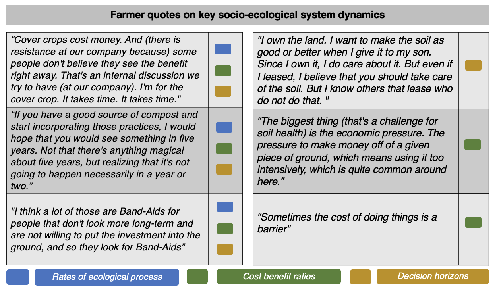
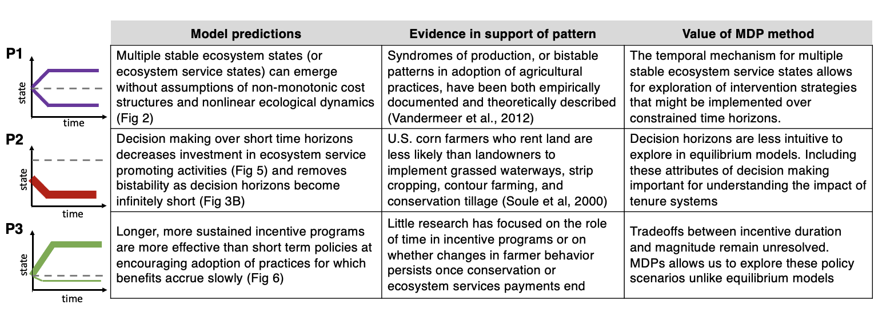

```{r render_to_word_doc, include = FALSE, eval = FALSE}
# run this to generate a word doc
# not perfect, will have to format word doc after
library(rmarkdown)
render("dfs-mdp-manuscript.Rmd", word_document())

```


```{r setup, include = FALSE}
rm(list = ls(all.names = TRUE)) # clean environment

# load external scripts
source("../R/load-libraries.R")
source("../R/dfs-mdp-model.R")
source("../R/sim-plot-fxns.R")

knitr::opts_chunk$set(echo = FALSE,
                      cache = FALSE,
                      message = FALSE,
                      warning = FALSE,
                      # eval = FALSE, # to knit faster - comment out to run code
                      fig.align = "center",
                      dev = "cairo_pdf")

pal <- solarized_pal()(7) # global color pallette
set.seed(4) # random seed
```

```{r model_def, include = FALSE}
# set up the MDP
actions <- seq(0, 1, length = 100)
states <- seq(0, 1.5, length = 100)
params <- list(
  benefit = 1.57, # changed from 1.56 to 1.57 to equalize distribution and help with fig 4 results
  cost = 1, 
  sigma = 0.1, 
  r = 0.1, 
  discount = 0.97, 
  Tmax = 20)
transition_fn <- function(s, a, params) s + params$r * (a - s)
utility_fn <- function(s, a, params) params$benefit * s - params$cost * a
model <- continuous_model(states, actions, params, transition_fn, utility_fn)

# solve the MDP
base_soln <- MDPtoolbox::mdp_value_iteration(model$P, model$U, params$discount)
base_soln_df <- tibble(state = states,
                       action = actions[base_soln$policy])

```

```{r global_sim_params, include = FALSE}
reps <- 500
init <- truncnorm::rtruncnorm(reps, 0, 1, 0.5, 0.2) %>% 
  map_int(function(x) which.min(abs(x - states)))
```


# Introduction

Both ecosystems and social systems can change states abruptly as the result of crossing critical thresholds. 
These critical thresholds (“tipping points”; states of a system where small perturbations can trigger large responses) have garnered extensive academic and public attention  (@gladwell2006tipping; @rockstrom2009safe). 
However, mechanisms of tipping points in SES remain largely explained by complex assumptions about either the ecological or social system dynamics (@Dai2012b; @Mumby2007; @Scheffer2010a; @Horan7333), rather than the rates at which they interact.

In social-ecological systems (SES), human actions impact ecological processes, and the resultant ecological changes create feedbacks that alter future management actions  (@liu2007complexity; @Ostrom2009; @Walker2004). 
When the temporal dynamics of ecological processes and their feedbacks to human systems (i.e. benefits from ecosystems services) do not align with the temporal scale of human decision-making these systems become complex to model (@Cumming2006a). 
Techniques previously used to investigate both dynamic ecological processes and decision-making in SES have mostly overlooked the temporal complexity of decision-making (@Lippe2019). 
For instance, , agent-based models are commonly used to explore complex emergent phenomena in SES. 
However, these models often use single time-step, or user-defined, decision rules rather than allowing for emergent decision strategies that maximize expected rewards over longer time horizons  (@Lippe2019). 
Similarly, economic models, which often explicitly consider the time horizons of decisions, often overlook ecological lags. 

<!-- need a citation here and to better build out the last point about equilibrium analyses and why this is the case -->

Agriculture is a fundamental driver of anthropogenic ecological change (@foley2005global; @foley2011solutions; @stoate2009ecological) and its productivity is closely intertwined with ecosystem processes that provide valuable ecosystem services. 
Agriculture is a quintessential social-ecological system (CITE) and an interesting case for exploring time lags because ecological responses to management actions (such as planting hedgerows) happen slowly, often taking years to return ecological benefits that exceed the timeframe of investments. 

While adoption of sustainable farm management practices undoubtedly encompasses a continuum of actions and outcomes, suites of practices are often used together in a package, coalescing around distinct stable states or “syndromes” (@Andow1989; @Ong2020a; @Vandermeer1997). 

The mechanisms used to explain these dynamics in production systems to-date have relied on the assumption that both ecological (or production) and decision (or economic) dynamics are non-monotonic.
 If either of these systems is approximated as monotonic in a coupled dynamic equation, the larger social environmental system is characterized by a single stable point (or no stable point), making alternative syndromes of production impossible to explain with dynamic equations  (@Vandermeer1997; @vandermeer2012syndromes).
In other words, the existence of two distinct stable states in agriculture -- defined by high levels of biodiversity and associated ecosystem services on one hand and low-levels of biodiversity and comparatively high synthetic inputs on the other -- cannot be explained in conventional models without assuming complex structural dynamics.
 While non-monotonic assumptions are often reasonable, these equilibrium explanations overlook the temporal component of both the ecological and decision processes central to agricultural SES.  

Markov Decision Processes (MDP) provide a convenient mathematical framework for modeling decision making in situations where outcomes are stochastic but partly under the control of a decision maker  (@bellman1957markovian). 
Importantly, MDPs allow for easy formulation of situations in which environments (in this case, agroecosystems) change slowly and land management decisions are forward looking (based on predictions about how those decisions will impact their farm productivity and vitality in the future). 
While MDPs have been widely used in a variety of environmental control problems (@Marescot2013b), they are rarely applied to modeling and exploring the dynamics of social-ecological systems. 

This paper presents a stylized Markov Decision Process model of the adoption of diversification practices to explore the ecosystem service patterns that result specifically from interactions between adaptive decision-making and an ever-changing environment. 
Using this model, we explore a mechanism for two prevailing environmental (ecosystem service) states, that is the result not of complex structural assumptions within either the human or ecological system, but rather the rates at which the two systems interact.
While our model necessarily simplifies both decision-making and environmental processes, it provides a framework to explore emergent properties in social-ecological systems.
We use farmer interview data to inform important structural attributes of our model, and to contextualize our findings. 
Finally, we show that our findings have important implications for agricultural policy implementation and social-ecological systems theory.

# Methods

We explore the transition to and from diversified farming systems (low and high ecosystem service provisioning states) using a Markov Decision Process (MDP) in which a farmer makes a series of decisions about whether or not to employ agricultural diversification  practices over time (Figure 1). In the context of diversified farming systems, diversification practices, such as hedgerows, crop rotation, intercrops, the use of compost, growing multiple crop types, reduced tillage, and cover crops, are distinct from the concept of operational diversification (i.e., simply increasing the range of agricultural goods produced on a given farm). The model was developed through an iterative, collaborative process with an interdisciplinary team comprising plant and soil scientists, agricultural economists, ecologists, agricultural sociologists, modelers, policy analysts, and farmers with the goal of capturing patterns stemming from the coupled human and natural dynamics of the modeled system.


## Interview data 

Our modeling work is inspired by patterns and system characteristics (e.g. the concept of forward-looking decision-making) that emerged from the extensive empirical fieldwork with farmers that our research team has conducted on working farms in California since 2013 (CITES). As part of the larger project that our modeling work contributes to, between February 2018 - August 2020, the agricultural sociologists in our team interviewed 25 lettuce growers and 17 almond growers from California using a snowball sampling method. We developed an interview guide with questions that focused on the barriers and motivations for using diversification practices such as cover cropping, planting hedgerows, and diverse crop rotations. We focused on the almonds and leafy greens/lettuce sectors because these are among the most valuable crops in California. We selected interviewees to represent a range of growers (small to large scale; organic to conventional, early adopters of diversification practices to late adopters/laggards, family run to corporate management, and direct-to-consumer marketing to wholesale). Interviews were conducted in person or over the phone in situations where in-person interviews were not possible due to farmer schedules or the need to social distance during COVID-19 restrictions. Most interviews were audio recorded and transcribed. If recording was not possible, careful notes were taken to create a transcript. We performed coding for key themes and keyword searches of the transcripts to inform key stuctural attributes of our model and provide quotes to contextulize findings.

## Conceptual model description

In our model at each time step the farmer takes an “action” of 0\% to 100\% percent investment in adopting or maintaining diversification practices. The “system state” corresponds to the level of benefit derived from the ecosystem services that result from those adoption decisions.  While higher ecological states are beneficial, investments in diversification practices also come with higher associated costs (Figure 1 A1). Benefits may be financial, social, ideological, and/or aesthetic and we approximate that relationship as linear (Figure 1 A2).  A greater percent investment in diversification practices corresponds to a greater probability of transitioning to a higher (more beneficial)  ecological state in the next decision cycle (Figure 1 A3). The rate at which that ecological response response occures depends on parameter, r, but importantly is not instaneous  (Figure 1 A4). By defining parameter values for cost, benefit, transition stochasticity, ecological change rate, and future discounting (Supporting information), we can allow the optimal action strategy for the agent (farmer) to emerge based on expected rewards over either a finite (to represent short-tenure leased farms) or infinite (to represent longer-term leases and land ownership) time horizon (Figure 1 A5). 

```{r assumption, echo = FALSE, message=FALSE, fig.align='center', fig.cap='Conceptual diagram and model assumptions. The farmer’s choice of how much to invest (time and money) into the adoption of diversification practices (blue), and the resulting ecosystem services state (green), with a more diversified ecosystem state at the top, and a more simplified ecosystem state at bottom. Each time step, the farmer chooses the optimal action for their current ecosystem service state based on the perceived utility function, u, and state transition probability function, p.  For a given ecosystem service state and action at time t, p describes how the ecosystem responds stochastically to result in an updated state at t + 1. The updated ecosystem service state then feeds back to influence the farmer’s future choices, leading to tradeoffs arising from the coupling of ecological processes with consecutive diversification practice adoption decisions over time. Main model assumptions (A1-A5) are outlined along with a brief rational for each approximation.', out.width='1\\linewidth', fig.pos='H'}
knitr::include_graphics("external-figs/assumptions.png")
```

## Mathematical description

The farmer's decision model can be expressed as

$$\max_{\lbrace a_t \rbrace} \mathbb{E} \left[ \sum_t^T u(s_t, a_t) \gamma^t \right]$$

where $\lbrace a_t \rbrace$ is the set of available actions, $\mathbb{E}$ the expected utility operator, $u(s_t, a_t)$ the utility which the farmer associates with being in state $s_t$ and taking action $a_t$ at time $t$, $\gamma$ the myopic discount factor, and $T$ the land tenure of the farm ($T \to \infty$ if the farmer owns the land or has a long lease).

We assume a simple model of the farmer's perceived utility $u(s_t, a_t)$ as a function of the difference between the cost $c_a$ associated with diversification practice action $a_t$, versus expected benefits $b_s$ derived from ecosystem state $s_t$, at time $t$, such that

$$u(s_t, a_t) = b_s s_t  - c_a a_t$$

The ecosystem state is also dynamic, evolving according to the transition probability function $p(s_t, a_t)$, such that

$$s_{t+1} = p(s_t, a_t) := s_t + r \left(a_t - s_t \right) + \epsilon$$

where $\epsilon \sim N(0, \sigma)$. This provides a minimal state transition model in which the parameter $r$ sets the natural timescale at which the ecosystem can respond to changes in land mangement decisions, and $\sigma$ defines the width of the state transition probability distribution, capturing the noise inherent to ecological system change.  While we have assumed very basic transition and utility functions for this stylized model, in general more complicated nonlinear functions for both the ecosystem state transition and perceived utility are possible using this framework.

## Parameterization

We have parameterized the model to illustrate the emergence of bistability in SES resulting from agroecological investment decision-making given stochastic ecological responses over time (Figure 1 and Figure 2; Parameter values in Supporting information). We explore a larger parameter space in the supporting information, and explain why the choice of parameters does not change the main findings.  

# Results

## Bistability in ecosystem services

Using the described model, we observe the behavior of agents’ sequential choices and the resultant environmental outcomes through time. The decision strategy,  $\pi$, describes the emergent optimal course of action for a given state and is the stationary optimal state-dependent decision strategy over an infinite time horizon (Figure 2A). 

Agents’ initial ecosystem states were distributed normally around a mean of $s =0.5$. We find that after following the optimal decision strategy (infinite horizon) for 20 decision cycles, agents have largely settled into two stable ecosystem states, with some farms transitioning to more simplified (lower levels of ecosystem services) farming systems, and others to more diversified (higher levels ecosystem services) systems (Figure 2B and 2C). Further, we find strong path dependency, with only 17\% of agents who started in a simplified ($s<0.5$) state concluding in a diversified ($s>0.5$) state, and only 7\% initially in the diversified state transitioning to a simplified state.

```{r base_case_sim, include = FALSE}
sim <- function(soln, 
                Tmax = params$Tmax,
                x0 = init){
  map_dfr(1:length(x0), 
          function(i) sim_mdp(model$P, model$U, soln$policy, params$discount, x0 = x0[i], Tmax = Tmax), 
          .id = "reps")
}
sims_baseline <- sim(base_soln)
# p_up_dn(sims_baseline)
```


```{r res_strategy, fig.cap = "Optimal decision strategy $\\pi$ as a function of ES state, showing a tipping point at $s \\approx 0.52$.  The upper $x$ axis limit is the 99th percentile of observed states in our simulation results ($s \\approx 1.3$).", fig.width = 3, fig.asp = 1, include=FALSE}

state99th <- sims_baseline %>% 
  mutate(state = states[state]) %>% 
  pull(state) %>% 
  quantile(.99) %>% 
  unname()
tpt <- 0
for(si in 1:length(states)-1) {
  if(base_soln_df$action[si] < .1 && base_soln_df$action[si+1] > .9) {
    tpt <- base_soln_df$state[si] + ((base_soln_df$state[2] - base_soln_df$state[1]) / 2)
  }
}

soln_plot(base_soln_df %>% filter(state <= state99th), tpt = tpt)

```


```{r res_bimodal, fig.cap = "Initial ecosystem states are distributed normally (mean = 0.5; S.D. = 0.2; truncated at [0,1]).  (A) Agents follow decision strategy $\\pi$ until $t = 20$.  (B) Ecosystem state of each agent over time (500 simulations).  (C) Initial ES distribution (dark blue) and final bimodal distribution at $t = 20$ (light blue).", fig.width = 6.5, fig.asp = .5, dpi=500}

ggarrange(
  soln_plot(base_soln_df %>% filter(state <= state99th), tpt = tpt),

  sim_plot_ts(sims_baseline, title = ggtitle("B. Timeseries"), rmarmod = -5), 
  sim_plot_dens(sims_baseline, title = ggtitle("C. State distributions"), 
                tpos = "panel", lab_lo_peak = TRUE, lab_hi_peak = TRUE, lmarmod = -5), 
  widths = c(3,2.75,2.2), nrow = 1, ncol = 3
)

# p_up_dn(sims_baseline)
```

## Importance of temporal dynamics in coupled systems

Our baseline model shows how a simple coupling of human choices and ecological response can result in bistable landscapes of high and low diversification practice adoption and, as a result, high and low levels of ecosystem services (Figure 2). By vary the time horizon of the decision process, the rate of the ecological response, and the cost/benefit ratio, we find that this tipping point disappears when the speed of response of either the ecological system or decision-making process overwhelms the coupling (a proxy for decoupling). 

Figure 3A shows that with temporal human/environment interactions, there exists a region of cost/benefit ratio within which various bimodal ecosystem state distributions exist (this region is exemplified in Figure 2). However, when ecological processes become fast enough that the ecosystem responds almost immediately to farmer actions ($r=0.95$), alternate stable states do not emerge, regardless of cost-benefit ratios (Figure 3C). Similarly, as decisions become temporally myopic (in this case, with a time horizon of 2 decision cycles), the potential for bistability in adoption trajectories disappears (Fig 3B). Only when both a gradually changing environment and a forward-looking decision-maker (i.e. a farmer who takes into account potential benefits over the long term) are coupled, do tipping point phenomena emerge in the decision strategy (and without non-monotonic assumptions), leading to two predominant ecosystem service states (Figure 3). As we observe in our interview data (Figure 4), as well as in extensive farmer decision-making and agroecosystem research, this is often the case in the real world.

```{r sim_b_sweep_fxn, include = FALSE}
sim_b_sweep <- function(scenarios, inf_fin, t_horiz = 2) {
  
  sim_b_sweep_scenario <- function(params) {
    model <- continuous_model(states, actions, params, transition_fn, utility_fn)
    if(inf_fin == "infinite") {
      soln <- MDPtoolbox::mdp_value_iteration(model$P, model$U, params$discount)
    } else if(inf_fin == "finite") {
      soln <- MDPtoolbox::mdp_finite_horizon(model$P, model$U, params$discount, N = t_horiz)
    } else stop('inf_fin must be "infinite" or "finite"')
    sim(soln, Tmax = params$Tmax) %>% 
      filter(time == params$Tmax)
  }
  
  scenarios %>%
    purrr::transpose() %>%
    furrr::future_map_dfr(sim_b_sweep_scenario, .id = "id") %>%
    left_join(scenarios, by = "id") %>%
    mutate(state = states[state])
}

```

```{r run_b_sweep_sims, cache = TRUE, include = FALSE}
# baselines: benefit = 1.57, cost = 1, sigma = 0.1, r = 0.1, discount = 0.97
chans_scenarios <- 
  tidyr::crossing(cbr = seq(.575, .725, length.out = 40),
                  cost = params$cost,
                  sigma = params$sigma,
                  r = params$r,
                  discount = params$discount,
                  Tmax = params$Tmax) %>% 
  tibble::rownames_to_column("id") %>%
  mutate(benefit = cost / cbr)
chans_sims <- sim_b_sweep(chans_scenarios, "infinite")

fast_r_scenarios <-
  tidyr::crossing(cbr = seq(.825, .975, length.out = 40),
                  cost = params$cost,
                  sigma = params$sigma,
                  r = 0.95,
                  discount = params$discount,
                  Tmax = params$Tmax) %>% 
  tibble::rownames_to_column("id") %>%
  mutate(benefit = cost / cbr)
fast_r_sims <- sim_b_sweep(fast_r_scenarios, "infinite")

myopic_d_scenarios <- 
  tidyr::crossing(cbr = seq(.025, .175, length.out = 40),
                  cost = params$cost,
                  sigma = params$sigma,
                  r = params$r,
                  discount = params$discount,
                  Tmax = params$Tmax) %>% 
  tibble::rownames_to_column("id") %>%
  mutate(benefit = cost / cbr)
myopic_d_sims <- sim_b_sweep(myopic_d_scenarios, "finite", t_horiz = 2)

```


```{r res_b_sweep, fig.cap = "For three scenarios (coupled human/natural system, overly-myopic decision maker, and overly-fast ecological change), cost/benefit ratio was varied incrementally over 40 values, indicated by color shade, across a $c:b$ range of width 0.15, encompassing the transition between a ``never invest'' to an ``always invest'' policy.  For each $c:b$, 500 replicate simulations were conducted as in Fig \\ref{fig:res_bimodal}.  Upper plots show distribution of ES state at $t=20$ for each $c:b$.  Lower plots show density curve peak(s).  (A) By coupling a forward-looking decision-maker and a slowly-adapting environment, complex dynamics like alternate stable states can emerge.  However, with (B) a short-term decision strategy (solving the MDP over a 2-year time horizon), or (C) a fast ecological change rate ($r = 0.95$), no bimodality is observed.", fig.width = 6.5, fig.asp = .55, dpi= 500}

ggarrange(
  ggarrange(
    plt_sim_b_sweep(chans_sims, title = ggtitle("A. Forward-looking decision \n     & slow ecological dynamics"), 
                    ylab = "Density", col = pal[1], rmarmod = -7, dnmarmod = -2.75) + 
      theme(legend.position="none"),
    plt_b_sweep_peaks(b_sweep_peaks(chans_sims), bizone = b_sweep_peaks(chans_sims, output_bizone = TRUE),
                      ylab = "Cost/benefit ratio", col = pal[1], rmarmod = -7, upmarmod = -2.75), 
    nrow = 2, ncol = 1, heights = c(1.1,1), align = "v"
  ),
  ggarrange(
    plt_sim_b_sweep(myopic_d_sims, title = ggtitle("B. Short-term decision \n strategy "), 
                    tpos = "panel", col = pal[4], lmarmod = -3.5, rmarmod = -3.5, dnmarmod = -2.75) + 
      theme(legend.position="none"),
    plt_b_sweep_peaks(b_sweep_peaks(myopic_d_sims), 
                      col = pal[4], lmarmod = -3.5, rmarmod = -3.5, upmarmod = -2.75), 
    nrow = 2, ncol = 1, heights = c(1.1,1), align = "v"
  ),
  ggarrange(
    plt_sim_b_sweep(fast_r_sims, title = ggtitle("C. Fast ecological \n dynamics"), 
                    tpos = "panel", col = pal[7], lmarmod = -7, dnmarmod = -2.75) + 
      theme(legend.position="none"),
    plt_b_sweep_peaks(b_sweep_peaks(fast_r_sims), 
                      col = pal[7], lmarmod = -7, upmarmod = -2.75), 
    nrow = 2, ncol = 1, heights = c(1.1,1), align = "v"
  ),
  nrow = 1, ncol = 3, widths = c(1,1,1)
)

```

## Implications for land tenure policy
 
While alternative mechanisms to explain a given phenomenom may seem inconsequntial to policy design, we show this is not the case. Additionally, given that temporal factors were central themes emerging from our interview data about adoption patterns (Figure 4) and that approximately 39\% of U.S. farmland is under lease, the impact of land tenure on farmer decision making is important for understanding agricultural management more broadly. For example, U.S. corn farmers who rent land are less likely than landowners to implement grassed waterways, strip cropping, contour farming, and conservation tillage (@soule2000land). 

```{r echo = F, warning = F, message = F, fig.width=6, fig.height = 8, out.width = ".9\\textwidth", fig.cap = "Key quotes from farmers suggest that the temporal horizons of decision making and the rate at which farmers recieve ecosystem benefits as a results of those decisions are important factors in the adoption of diversification practices"}

```

We solve the MDP on a constrained time horizon (20-decision cycles, in comparison to an infinite time horizon in Fig 2), representing the shorter horizon on which tenant farmers might make decisions (Fig 4B). Comparing the final state distribution of the long-tenure (baseline) versus the short-tenure model shows that, as a farmer’s expected land tenure duration decreases, it becomes optimal to reduce diversification adoption across a wider range of ecosystem states. This results in ecosystem state degradation even among farm sites with an initially high ecosystem service value, with 94\% of farmers ending up in the simplified state at $t=20$. However, the duration of land tenure does not necessarily define decision horizons. Numerous economic and cultural factors -- for example, whether farmers are highly motivated to seek sustainability -- might also impact the timeframe in which a farmer expects to see benefits.

```{r short_tenure_sim, include = FALSE}
short_tenure_soln <- MDPtoolbox::mdp_finite_horizon(model$P, model$U, params$discount, N = 20) 
sims_short_tenure <- sim(short_tenure_soln)
```

```{r res_tenure, fig.cap = "The simulation is identical to that in Fig \\ref{fig:res_bimodal}, but the MDP is solved under a finite, 20-year time horizon. (A) Result of short land tenure on ES state over time.  (B) Comparison between final state distribution of short- vs. long-tenure model runs.", fig.width = 6.5, fig.asp = .5,dpi=500}
ggarrange(
  sim_plot_ts(sims_baseline, title = ggtitle("A. Long-tenure"),
            annotate = TRUE, 
              rmarmod = -10),
  sim_plot_ts(sims_short_tenure, 
              title = ggtitle("B. Short-tenure"), 
              endcol = pal[3], 
              tpos = "panel", ytxtoff = T,rmarmod = -5, lmarmod = -5),
  sim_plot_dens_comp(sims_baseline, sims_short_tenure, 
                     label1 = "Long\ntenure\nfinal", 
                     label2 = "Short\ntenure\nfinal", 
                     title = ggtitle("C. State distribution"), 
                     tpos = "panel", lmarmod = -5),
 nrow = 1, ncol = 3, widths = c(1,1,1))
```


```{r incentives_sim, include = FALSE}
# set incentive simulation parameters
T_incent_1 <- 2
T_incent_2 <- 10

# calc modified cost during incentive = 1 - 2 / T_incent
C_incent_1 <- 1 - 2 / T_incent_1
C_incent_2 <- 1 - 2 / T_incent_2

# incentive simulation fxn
incent_sim <- function(params) {
  incent_model <- continuous_model(states, actions, params, transition_fn, utility_fn)
  incent_soln <- MDPtoolbox::mdp_value_iteration(incent_model$P, incent_model$U, params$discount)
  # simulate incentive period
  start <- sim(incent_soln, Tmax = params$T_incent, x0 = init)
  xi <- start %>% filter(time == params$T_incent) %>% pull(state)
  # pad to Tmax with baseline decision rule
  rest <- sim(base_soln, Tmax = params$Tmax - params$T_incent, x0 = xi) %>% 
    filter(time!=0) %>% mutate(time = time + params$T_incent)
  bind_rows(start, rest) 
}

# run incentive simulation
sims_incent_abrupt <- incent_sim(list(benefit = params$benefit, 
                                      cost = C_incent_1, 
                                      sigma = params$sigma, 
                                      r = params$r, 
                                      discount = params$discount, 
                                      T_incent = T_incent_1, Tmax = params$Tmax))
sims_incent_sust <- incent_sim(list(benefit = params$benefit, 
                                    cost = C_incent_2, 
                                    sigma = params$sigma, 
                                    r = params$r, 
                                    discount = params$discount, 
                                    T_incent = T_incent_2, Tmax = params$Tmax))

```


```{r res_incentive, fig.cap = "Starting from the same initial states as Fig \\ref{fig:res_bimodal}, ES state timeseries are shown for (A) a large, abrupt incentive (100\\% of adoption expenses are covered for two years) vs. (B) a smaller, more sustained incentive (adoption cost is 80\\% of baseline for 10 years).  Ignoring discounting, both packages have the same total cost to the funder (the equivalent of 2 years' worth of full adoption cost offsets).  After the incentive period, agents adjust their decision rules to that of the base case (i.e. no incentive) until $t = 20$.  (C) Shows that the sustained incentive ultimately drove more DP adoption.", fig.width = 6.5, fig.asp= 0.5, dpi=500}

ggarrange(
  sim_plot_ts(sims_incent_abrupt, title = ggtitle("A. Concentrated incentive"), 
              annotate = TRUE, an_x = T_incent_1, an_lab = sprintf("%i cycles\n%i%% off", T_incent_1, round((1-C_incent_1)*100)), 
              rmarmod = -10, endcol = pal[5]),
  sim_plot_ts(sims_incent_sust, title = ggtitle("B. Sustained incentive"), 
              annotate = TRUE, an_x = T_incent_2, an_lab = sprintf("%i cycles\n%i%% off", T_incent_2, round((1-C_incent_2)*100)), 
              tpos = "panel", ytxtoff = T, endcol = pal[6], rmarmod = -5, lmarmod = -5),
  sim_plot_dens_comp(sims_incent_abrupt, sims_incent_sust, sims_base = sims_baseline, 
                     label1 = "Concentrated\nincentive", label2 = "Sustained\nincentive", label_base = "No\nincentive", 
                     title = ggtitle("C. Final distributions"), tpos = "panel", 
                     cvec = c(pal[2], pal[5], pal[6]), lmarmod = -5, rmarmod = -5),
  nrow = 1, ncol = 3, widths = c(1,1,1.2)
)

# print("abrupt: ")
# p_up_dn(sims_incent_abrupt)
# print("sustained: ")
# p_up_dn(sims_incent_sust)
```

## Temporal dynamics and incentive structures 

One benefit of understanding mechanisms of bistability in coupled systems is that capacity to explore how incentives that shift cost-benefit structures influence management practices. We explore the impact of incentive duration on the efficacy of policies to promote adoption of diversification practices by implementing two competing publicly funded incentive schemes: a short-term (two-time step) incentive which fully covers the cost of adoption, versus a longer-term (ten-time step) incentive which only partially offsets the adoption costs over those time steps. Formally, the cost of each incentive package is equal. Within the model, agents adapt their optimal decision strategy for the given cost-benefit ratio during the incentive period, and at its conclusion they revert to the baseline strategy (i.e. without payments).

We find longer, more sustained incentive programs to be more effective at encouraging adoption behavior over the critical threshold toward diversified farming (Fig 5). Once a farmer has crossed the viable ecosystem state threshold, it becomes less likely that they will return to simplified systems, even after incentives are removed. Because it takes a series of investment actions for the ecosystem service state to cross the investment threshold, longer-term incentives ultimately result in more diversification practice adoption.

# Discussion

Our analysis suggests a mechanism for bistability in social-ecological systems that is the result of temporal interactions between forward-looking decisions and ecological processes rather than complex structural assumptions about either system alone. While alternate stable states within social ecological systems, and farming systems in particular, have been previously explored and observed (@Horan2011a; @vandermeer1997syndromes; @Vandermeer2012), our results shed light specifically on temporal feedbacks that might contribute to this pattern (Figure 6). We show how path dependence can result in self perpetuating low ecosystem states and low adoption of diversification practives (Figure 2) and why this provides novel insights not only for social-ecological research (Figure 3), but also for agricultural policy (Fig 4 and Fig 5). 

In contrast to equilibrium models (@Vandermeer2012), our model assumes (Figure 1) that ecological and environmental processes take time and incorporates the resulting delay between adopting a diversified practice and seeing the benefits. For example, soil organic matter and its benefits (such as improved water retention and storage of essential nutrients) take years to build after starting practices like cover cropping and compost additions (@poeplau2015carbon). This reality is suggested by our interviews with farmers. One farmer explains: 

“I'll use five years, which seems like a long time, but I mean, that's only potentially 5 or 10 crop cycles depending how heavy you crop. To get expertise in something or to get an understanding of something takes a while. There's probably some very good soils that can be turned around relatively quickly if everything works right. Somebody might see some pretty dramatic benefits in a year or two, depending how bold they wanted to do things. But I think the changes in soil in my mind, they're not immediate. You don't make grand changes right away. So I mean, if you get started doing some reduced tillage using more cover crops, if you have a good source of compost and start incorporating those practices, I would hope that you would see something in five years. Not that there's anything magical about five years, but realizing that it's not going to happen necessarily in a year or two. But two to year five you should start to see subtle changes. And then after five years, you've incorporated some practices that are pretty positive. You've learned from some of your mistakes. You've gained a lot of knowledge. You've kind of seen what works on your ground". 

[AI: To address Claire’s point about Table 1, I think you need a few lines here to build on the above and say what the model contributes in terms of insight as regards #1.]


```{r predictions, echo = FALSE, message=FALSE, out.width = "1\\textwidth", fig.cap='Table of the main model predictions, evidence in support of the pattern, value added of the temporal mechanism and minimal assumptions.'}

```

Our results also have important real-world implications for understanding farmer decision-making behavior and agricultural policy design. Our model confirms that the land tenure status of a farmer can greatly influence their willingness and ability to adopt diversification practices (Figure 5; Table 1 P2). This finding accords with a large body of sociological research documenting how security and length of land tenure affects adoption of sustainable agricultural practices (@fraser2004land; @long2017hedgerow; @richardson2015land; @soule2000land), suggesting that our model captures emergent socio-ecological dynamics of farming systems. The time required to see benefits influences the adoption patterns seen across short- and long-term tenants. As another farmer explains, “We do have hedge rows on several of the ranches, more where we have long-term leases.” Growers who hold shorter leases are more likely to decide that adopting diversification practices will not benefit them, since they may lose their investment if their lease ends forcibly, or may have insufficient time to learn how to use practices in the particular ecological and geographical conditions of their farm (@calo2016after; @calo2018knowledge). Immigrant farmers and farmers of color often struggle to achieve stable land tenure due to language problems, poverty, and racial discrimination in farmer networks, policy, and finance. 

Finally, our model suggests that existing incentive programs to promote agricultural sustainability and ecosystem services by reducing the costs of practice adoption may need significant redesign (Figure 6; Table 1 P3). Such policies have become an integral part of farming over the past half-century (@Batary2015a; @graddy2017supply). They are particularly interesting to explore with a Markov Decision Process due to their often sequential, but time limited, nature. Incentive policies rolled out over a given time frame are difficult to study with equilibrium analyses or with simple decision rules. 

Our results suggest that long-term, sustained incentives, even when only partially covering the cost of adoption, may be more effective in shifting farmers from simplified ecological states to diversified states than more concentrated short-term incentives. We show that the cost of interventions and the social-environmental benefit of those interventions are not necessarily equivalent. Rather, the stability of incentive programs over time that farmers perceive may be an important driver of adoption, which can be overlooked if the temporal rates of coupled dynamics in social-environmental systems are not considered.  If farmers expect a stable source of support over a significant time period, they may decide it is worthwhile to experiment and persist with a new practice that may not provide observable benefits for many years (@claassen2014additionality). Unstable support, by contrast, may lead to farmers abandoning practices after a short time, or even not trying those out (@dayer2018private). Reduced transaction costs that come with farmers making a longer-term commitment may also partially explain the greater impact of sustained incentives as compared to concentrated incentives. 

 Our finding is particularly relevant to the design of government payment programs and suggests that somewhat smaller payments can be highly effective in encouraging adoption of diversification practices (or other ecosystem service promoting practices) when  distributed over long time horizons. Small payments over a longer time-frame also constitute a lower total cost to the government when considering even modest discount rates. Surprisingly little research has focused on the role of time in incentive programs and on whether changes in farmer behavior persists once conservation or ecosystem services payments end. One study found that when landowners were unable to re-enroll in a waterbird habitat program in northern California due to 3 year period limits, participant numbers declined and farmers persisted less with their practices (@dayer2018private). Other studies have found that growers can readily switch back land that is left unused in return for payments via the federal Conservation Reserve Program to ‘more valuable’ productive uses (e.g. corn ethanol: (@roberts2007enduring)). 
 
A number of federal government programs provide incentives to farmers over long time periods. For example, the US Department of Agriculture (USDA) manages a Conservation Stewardship Program (CSP) that helps growers build on their existing conservation practices by developing a plan to implement practices that improve a wide range of on-farm conditions, from soils to biodiversity. CSP offers a 5-year contract -- potentially renewed for 5 years more -- that pays farmers an annual amount in return for their agreeing to implement a customized conservation plan co-created with a USDA agent. In contrast, USDA also manages the Environmental Quality Improvement Program (EQIP), which similarly supports on-farm diversification practices. Contracts usually last 1-3 years but may go to 10 years. Payment rates are reviewed and changed annually; certain practices may receive sizable assistance but rates can be unstable over time (@USDApayments). Both CSP and EQIP are heavily oversubscribed by farmers in many states, including California (@wyant_2020). Moreover, EQIP is a “cost-sharing” scheme, so farmers must contribute their own funds as well, yet may not have adequate resources to participate. In addition, California’s Healthy Soils Program, founded in 2017, currently funds growers only for 3 years and only for "new" projects on "new land" (@healthysoils). It is still too soon to determine whether this design affects the durability of diversification practices. In other words, existing policies could do much more to build sustained and effective incentive regimes, and our model results support this.

In conclusion, by centering temporal dynamics in a social ecological system model, we offer insights into important agricultural patterns and their implications for policy. We present a flexible model framework that can be built on to address numerous questions in social-ecological systems research and policy design.


# Model implementation

The model was developed in the *R* programming language [@RCT2019].  The *MDPtoolbox* library was used to set up and solve the MDP [@Chades2017].  Code for our model and the experiments conducted in this paper is available freely at [https://github.com/boettiger-lab/dfs-mdp](https://github.com/boettiger-lab/dfs-mdp). 

# Author Contributions: 

Conceptualization CB, MC, SW, PB, TB, LC, FC, KE, SG, AI, DK, CK, JL, EO, JO, MR, AS, JT, HW; Data curation: MC, SW, CB; Formal Analysis: MC, SW, CB; Funding acquisition: TB, AI, CK, DK, CB; Methodology: CB, MC, SW, PB, TB, LC, FC, KE, AI, DK, CK, EO, JT, HW; Code: MC, SW, CB; Visualization: MC, SW, CB; Writing – original draft: MC, SW, CB, LC; Writing – review & editing: CB, MC, SW, PB, TB, LC, FC, KE, SG, AI, DK, CK, JL, EO, JO, MR, AS, JT, HW 

# Acknowledgments

Funding for this research was provided by the National Science Foundation grant number CNH-1824871

# References
