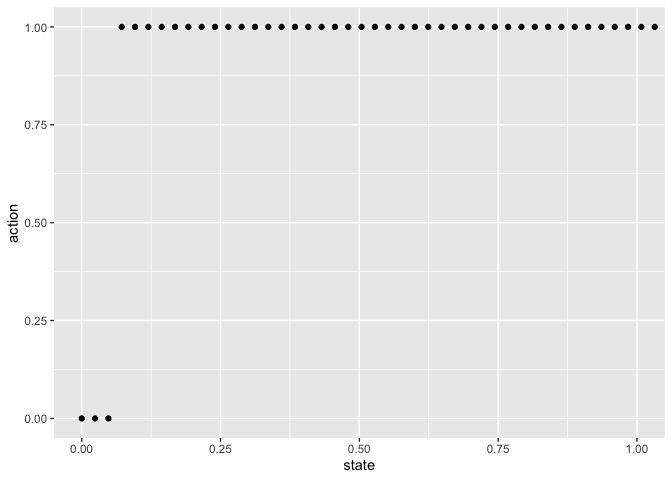

``` r
library(tidyverse)
library(MDPtoolbox)

## Helper function returns the utility and transition matrices for this model
source("../R/single-step-model.R")
```

In this formulation, we consider a single-step model, where the
probability of an increase or decrease in ecosystem state is
proportional to the contrast between ecosystem state and diversified
practice. (Note that because this model only allows single step
transitions, increasing the overall size of the state space is
equivalent to slower transition rates. Condequently the discount rate
must be adjusted to reflect the change in timescale).

# Example solution

The optimal solution is bang-bang, with farmers opting for maximum or
minimum investment in DP, rather than in intermediate levels of
investment. There exists a region of state space where high-state farms
will invest in diversified practice while low-state farms will
diss-invest. This dynamic is driven by a trade-off between the long-term
payoff from diversified practice vs the cost of discounting.

``` r
states <- seq(0,1.2, length=51)
actions <- seq(0,1, length=51)
params <- list(benefit = 1.5 , cost = 1, stability = .5)


model <- single_step_model(states, actions, params)

discount <- 0.993
soln <- MDPtoolbox::mdp_value_iteration(model$P, model$U, discount)
```

    ## [1] "MDP Toolbox: iterations stopped, epsilon-optimal policy found"

``` r
tibble(state = states,
       action = actions[soln$policy]) %>%
  ggplot(aes(state,action)) + geom_point() + coord_cartesian(xlim = c(0,1))
```

<!-- -->
